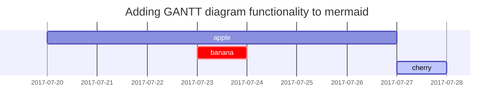

## Headings

<!-- markdownlint-capture -->
<!-- markdownlint-disable -->
# H1 — heading
{: .mt-4 .mb-0 }

## H2 — heading
{: data-toc-skip='' .mt-4 .mb-0 }

### H3 — heading
{: data-toc-skip='' .mt-4 .mb-0 }

#### H4 — heading
{: data-toc-skip='' .mt-4 }
<!-- markdownlint-restore -->

## Paragraph

Just to be clear, both are still alive—provided Dad’s not drunk enough to have fallen asleep on the street somewhere and frozen, and Mum’s not getting a heart attack from it, which has happened before. Considering the pleasant spring all over our northern hemisphere, I guess fatality is unlikely, so all good!

Last week I saw tons of private messages from Mum, which was unusual. For context, I barely message my parents and we never call each other (which I think is for the best). The three of us do have a group chat where they share gossip about who slept with whom at work, which managers just got arrested, what crazy assets turned up when the government raided their homes, and how much money they paid to the Regime to get released, but nothing more than that (Yes, my parents work at the same place, and no, it’s not a good idea).

I skimmed through Mum’s messages, no arrests, no scandals, boring, just Dad’s office politics mess, which has escalated to the point where my parents are considering a divorce because they really can’t reconcile their positions. Also, Dad has been drinking heavily, and at the tender age of fifty-something, decided to run away from home. Dad’s whereabouts are currently unknown, but I know if Mum actually wanted to find him, she would have succeeded.

I blocked Mum and the group chat for two years previously—this included the time I was working in Mexico—during which she (as she put it) sensed through “telepathic connection” that I had returned to China at some point. She “called some friends” and located all my immigration history, flight details, and possibly other travel records, which she was kind enough not to let me know about. She used to talk about this endeavour with great enthusiasm, often in front of others, to demonstrate how much she “loved me”. Considering she hasn’t done that to Dad, I guess the love between them really is gone—and to be fair, its shelf life had already far exceeded my expectations.

The messages involved tons of documents, chat records, and voice messages that bore an odd resemblance to a messy evidence bundle from an aggressive client, but since I happened to be working on a trial-summary exercise anyway, I figured I might as well treat it as practice. It was overwhelming at first, but after weeding out Mum’s emotional rambling, the case became quite clear:

The parties are, obviously, my parents, who went to university together and have been working at the same public hospital alongside many of their classmates since graduation. Growing up, I was immersed in over 30 years of gossip involving the same rotating cast of people. The stage is the largest public hospital locally (which, in a Chinese context, means it runs like a government organisation and the doctors are treated as civil servants). 


## Lists

### Ordered list

1. Firstly
2. Secondly
3. Thirdly

### Unordered list

- Chapter
  - Section
    - Paragraph

### ToDo list

- [ ] Job
  - [x] Step 1
  - [x] Step 2
  - [ ] Step 3

### Description list

Sun
: the star around which the earth orbits

Moon
: the natural satellite of the earth, visible by reflected light from the sun

## Block Quote

> This line shows the _block quote_.

## Prompts

<!-- markdownlint-capture -->
<!-- markdownlint-disable -->
> An example showing the `tip` type prompt.
{: .prompt-tip }

> An example showing the `info` type prompt.
{: .prompt-info }

> An example showing the `warning` type prompt.
{: .prompt-warning }

> An example showing the `danger` type prompt.
{: .prompt-danger }
<!-- markdownlint-restore -->

## Tables

| Company                      | Contact          | Country |
| :--------------------------- | :--------------- | ------: |
| Alfreds Futterkiste          | Maria Anders     | Germany |
| Island Trading               | Helen Bennett    |      UK |
| Magazzini Alimentari Riuniti | Giovanni Rovelli |   Italy |

## Links

<http://127.0.0.1:4000>

## Footnote

Click the hook will locate the footnote[^footnote], and here is another footnote[^fn-nth-2].

## Inline code

This is an example of `Inline Code`.

## Filepath

Here is the `/path/to/the/file.extend`{: .filepath}.

## Code blocks

### Common

```text
This is a common code snippet, without syntax highlight and line number.
```

### Specific Language

```bash
if [ $? -ne 0 ]; then
  echo "The command was not successful.";
  #do the needful / exit
fi;
```

### Specific filename

```sass
@import
  "colors/light-typography",
  "colors/dark-typography";
```
{: file='_sass/jekyll-theme-chirpy.scss'}

## Mathematics

The mathematics powered by [**MathJax**](https://www.mathjax.org/):

$$
\begin{equation}
  \sum_{n=1}^\infty 1/n^2 = \frac{\pi^2}{6}
  \label{eq:series}
\end{equation}
$$

We can reference the equation as \eqref{eq:series}.

When $a \ne 0$, there are two solutions to $ax^2 + bx + c = 0$ and they are

$$ x = {-b \pm \sqrt{b^2-4ac} \over 2a} $$

## Mermaid SVG



## Images

### Default (with caption)


_Full screen width and center alignment_

### Left aligned


### Float to left


Praesent maximus aliquam sapien. Sed vel neque in dolor pulvinar auctor. Maecenas pharetra, sem sit amet interdum posuere, tellus lacus eleifend magna, ac lobortis felis ipsum id sapien. Proin ornare rutrum metus, ac convallis diam volutpat sit amet. Phasellus volutpat, elit sit amet tincidunt mollis, felis mi scelerisque mauris, ut facilisis leo magna accumsan sapien. In rutrum vehicula nisl eget tempor. Nullam maximus ullamcorper libero non maximus. Integer ultricies velit id convallis varius. Praesent eu nisl eu urna finibus ultrices id nec ex. Mauris ac mattis quam. Fusce aliquam est nec sapien bibendum, vitae malesuada ligula condimentum.

### Float to right


Praesent maximus aliquam sapien. Sed vel neque in dolor pulvinar auctor. Maecenas pharetra, sem sit amet interdum posuere, tellus lacus eleifend magna, ac lobortis felis ipsum id sapien. Proin ornare rutrum metus, ac convallis diam volutpat sit amet. Phasellus volutpat, elit sit amet tincidunt mollis, felis mi scelerisque mauris, ut facilisis leo magna accumsan sapien. In rutrum vehicula nisl eget tempor. Nullam maximus ullamcorper libero non maximus. Integer ultricies velit id convallis varius. Praesent eu nisl eu urna finibus ultrices id nec ex. Mauris ac mattis quam. Fusce aliquam est nec sapien bibendum, vitae malesuada ligula condimentum.

### Dark/Light mode & Shadow

The image below will toggle dark/light mode based on theme preference, notice it has shadows.


## Video



## Reverse Footnote

